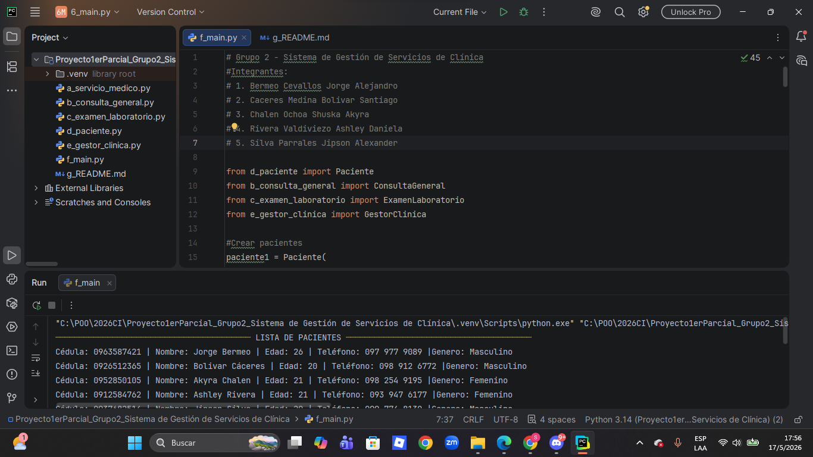
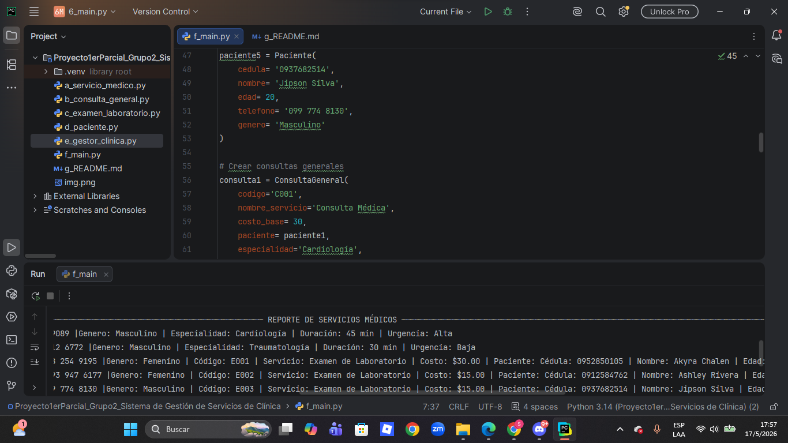
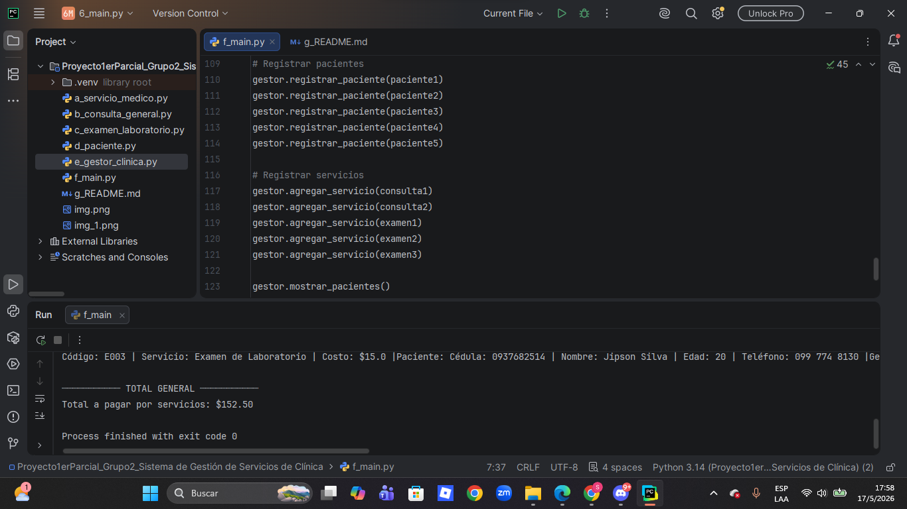

# Proyecto Primer Parcial - Programación Orientada a Objetos

## Grupo 2 - Sistema de Gestión de Servicios de Clínica

### Integrantes

* Bermeo Cevallos Jorge Alejandro.
* Cáceres Medina Bolívar Santiago.
* Chalen Ochoa Shuska Akyra.
* Rivera Valdiviezo Ashley Daniela.
* Silva Parrales Jipson Alexander.

---

# Descripción del Proyecto

Este proyecto consiste en el desarrollo de un Sistema de Gestión de Servicios de Clínica utilizando Programación Orientada a Objetos en Python.

El sistema permite:

* Registrar pacientes.
* Gestionar consultas generales.
* Gestionar exámenes de laboratorio.
* Calcular costos según el tipo de servicio.
* Aplicar herencia, encapsulamiento y polimorfismo.
* Generar reportes completos de los servicios médicos.

---

# Clases Implementadas

## Superclase

* servicio_medico

## Clases hijas

* consulta_general
* examen_laboratorio

## Clases adicionales

* paciente
* gestor_clinica

---

# Explicación / Relación de Clases

ServicioMedico es la superclase principal del sistema y contiene los atributos y métodos generales de todos los servicios médicos.

Las clases ConsultaGeneral y ExamenLaboratorio heredan de ServicioMedico, reutilizando atributos y métodos comunes mediante herencia.

La clase Paciente almacena la información de los pacientes registrados en la clínica.

La clase GestorClinica administra el sistema, permitiendo registrar pacientes, agregar servicios médicos, mostrar reportes y calcular el total general.

---

# Principios de Programación Orientada a Objetos Aplicados

## Encapsulamiento

* Uso de atributos privados
* Uso de @property y @setter para validaciones.

## Herencia

* ConsultaGeneral hereda de ServicioMedico.
* ExamenLaboratorio hereda de ServicioMedico.

## Polimorfismo

* Método calcular_costo()
* Método mostrar_info()

Cada clase hija redefine estos métodos para generar resultados diferentes según el tipo de servicio médico.

---

# Funcionamiento del Sistema

El sistema permite crear pacientes, registrar consultas médicas y exámenes de laboratorio, almacenar la información en listas y generar reportes automáticos.

Además, calcula el total general de los servicios médicos registrados utilizando métodos polimórficos.

---

# Instrucciones para Ejecutar

1. Descargar o clonar el repositorio.
2. Abrir el proyecto en PyCharm o Visual Studio Code.
3. Ejecutar el archivo main.py.
4. El sistema mostrará:

   * Lista de pacientes.
   * Reporte de servicios médicos.
   * Total general de servicios.

---
# ¿Cómo funciona el programa?
### Video explicativo:
https://youtu.be/_ZjYMv0ksLg

---
# Capturas de la ejecución

